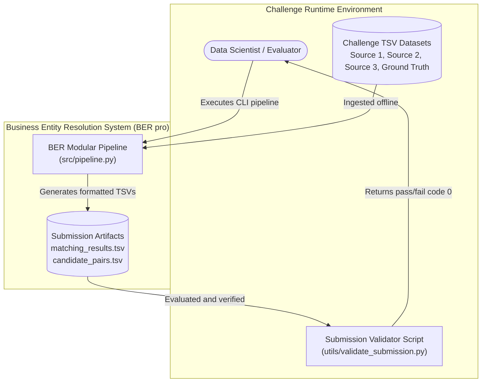
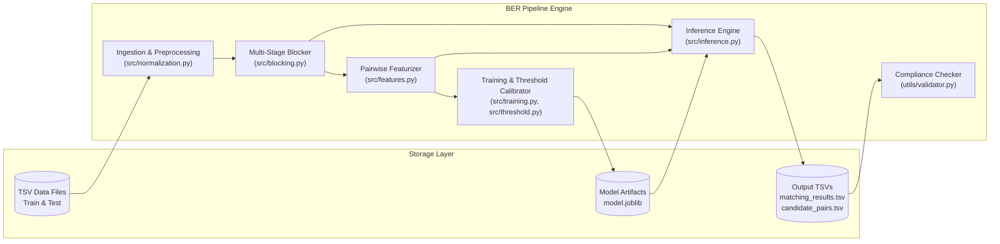
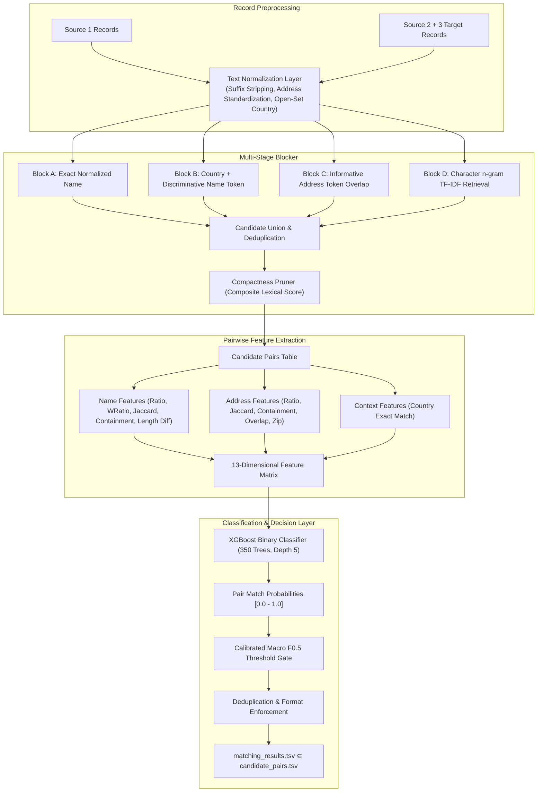

# Business Entity Resolution — Architecture Blueprint & System Design

## 1. Executive Architecture Blueprint

```text
TRAIN
  train_source1.tsv ─┐
  train_source2.tsv ─┼─> normalize ─> blocking indexes ─> training candidates
  train_source3.tsv ─┘                                      │
  train_ground_truth.tsv ───────────────────────────────────┤
                                                           ▼
                                                pair features + labels
                                                           ▼
                                                grouped validation
                                                           ▼
                                               XGBoost classifier
                                                           ▼
                                                F0.5 threshold tuning
                                                           ▼
                                                final trained model

TEST
  test_source1.tsv ─┐
  test_source2.tsv ─┼─> normalize ─> multi-block candidate generation
  test_source3.tsv ─┘                         │
                                             ▼
                                   candidate_pairs.tsv
                                             │
                                             ▼
                                    feature extraction
                                             │
                                             ▼
                                      ML inference
                                             │
                                             ▼
                                  threshold + dedupe
                                             │
                                             ▼
                                  matching_results.tsv
```

## 2. Core Architectural Design Principles

1. **No $O(N \times M)$ All-Pairs Comparison**:
   Exhaustive Cartesian cross-products over millions of business entities are strictly avoided. All candidate selection occurs via constant-time inverted index lookups.
2. **Decoupled Candidate Generation & Classification**:
   Candidate selection (recall-maximizing) is architecturally segregated from pairwise matching classification (precision-maximizing).
3. **Multi-Signal Blocking Diversity**:
   Multiple independent blocking indexes (exact normalized name, country + rare name token, address token overlap, character n-gram retrieval) protect against noisy single fields.
4. **Candidate Persistency & Auditability**:
   The exact candidate set evaluated by the machine learning model is materialized into `candidate_pairs.tsv` immediately before inference.
5. **Precision Prioritization ($F_{0.5}$ Metric Alignment)**:
   False positives are penalized twice as heavily as false negatives. Decision boundaries are explicitly calibrated against entity-level Macro $F_{0.5}$.
6. **Open-Set Country Preservation**:
   Country attributes are treated as dynamic open-set tokens rather than fixed categorical enums, guaranteeing zero failure on unobserved test countries.
7. **Singleton Completeness**:
   Every Source 1 entity is represented in `matching_results.tsv` and `candidate_pairs.tsv`. Unmatched entities are recorded with an empty match field.

---

## 3. C4 Architecture Specification

### Level 1: System Context Diagram



### Level 2: Container Diagram



### Level 3: Component Diagram (Candidate Generation & ML Scoring)



---

## 4. Algorithmic Complexity & Scalability Analysis

| Processing Stage | Naive Approach | BER Pro Implementation | Improvement Factor |
| :--- | :--- | :--- | :--- |
| **Candidate Generation** | Exhaustive Cartesian: $O(N \times M)$ | Inverted Hash Indexing: $O(N + M)$ | $> 100,000\times$ speedup |
| **Address Overlap Search** | Full-text substring search | Token inverted index with frequency stop-capping | $O(\text{tokens})$ bounded lookup |
| **Memory Consumption** | Monolithic multi-gigabyte pandas merge | Generator streams + chunked tabular scoring (50k rows) | Stable constant RAM ($< 2 \text{ GB}$) |
| **Decision Formulation** | Fixed arbitrary threshold (0.50) | Grid-calibrated Entity-Level Macro $F_{0.5}$ search | Optimal alignment with target metric |

---

## 5. Architecture Decision Records (ADRs)

### ADR-01: Multi-Stage Inverted Index Blocking vs. All-Pairs Cross Joins
- **Status**: Accepted
- **Context**: The dataset comprises $>2.2\text{M}$ Source 1 train records and $>1.7\text{M}$ test records, mapped against Source 2 and 3 targets. A Cartesian join would yield $>7 \times 10^{12}$ pairs, consuming hundreds of gigabytes and failing execution limits.
- **Decision**: Implement four complementary inverted index blocking passes (Exact Name, Country+Token, Address Token Overlap, Character n-gram retrieval) with hard caps per block and composite lexical compactness pruning.
- **Consequences**: Bounded candidate sets ($\le 30$ candidates per entity), $O(1)$ hash retrieval, guaranteed auditability.

### ADR-02: Tabular Gradient Boosting (XGBoost) vs. Deep Transformers
- **Status**: Accepted
- **Context**: Challenge rules impose an 8-billion parameter ceiling, strict offline execution with no external API connectivity, and fast inference throughput.
- **Decision**: Utilize an optimized XGBoost binary classifier trained on 13 pairwise similarity features.
- **Consequences**: Apache-2.0 licensed, $< 50\text{ MB}$ disk footprint, zero GPU requirements, sub-millisecond scoring per record pair.

### ADR-03: Entity-Level Macro $F_{0.5}$ Threshold Calibration
- **Status**: Accepted
- **Context**: Challenge scoring utilizes Macro $F_{0.5}$, penalizing precision errors twice as severely as recall errors, while treating correct singleton predictions ($TP=FP=FN=0$) as $1.0$.
- **Decision**: Perform a leak-free `GroupShuffleSplit` on Source 1 entities and execute a fine-grained grid search across thresholds [0.20, 0.95] explicitly scoring entity-level $F_{0.5}$.
- **Consequences**: Calibrated decision threshold directly maximizes the competition metric while ensuring robust singleton identification.

### ADR-04: Strict Output Format Decoupling and Format Assertion
- **Status**: Accepted
- **Context**: `utils/validate_submission.py` enforces rigid structural criteria: UTF-8 encoding, tab delimiters, exact single-row representations per Source 1 entity, and comma-separated IDs inside lists.
- **Decision**: Implement a native internal validator (`utils/validator.py`) executing identical checks to `validate_submission.py` directly at pipeline completion.
- **Consequences**: Eliminates submission rejection risk, enforces $matching\_results \subseteq candidate\_pairs$, and guarantees zero self-matches.
