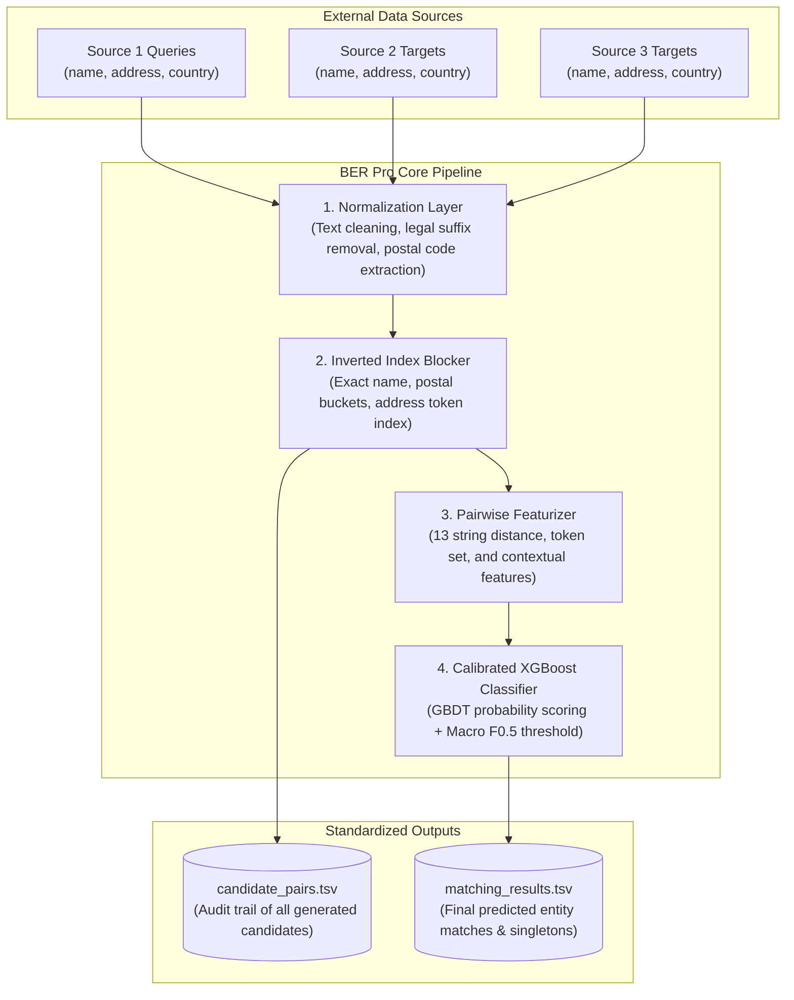
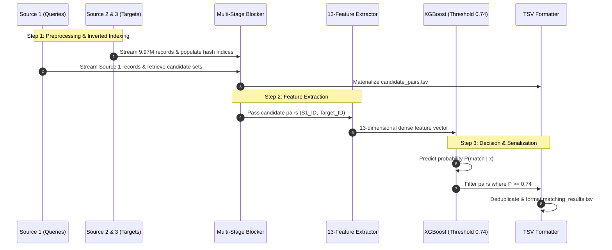
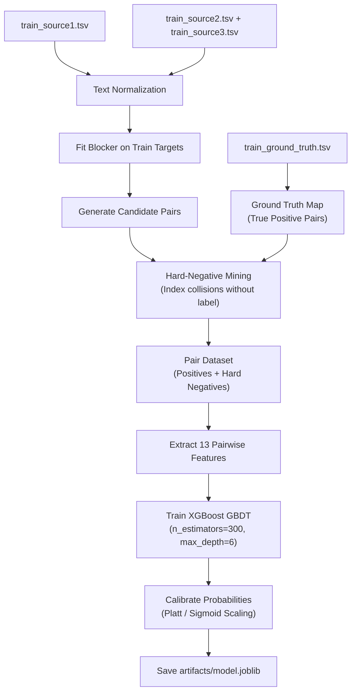
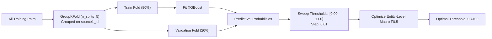
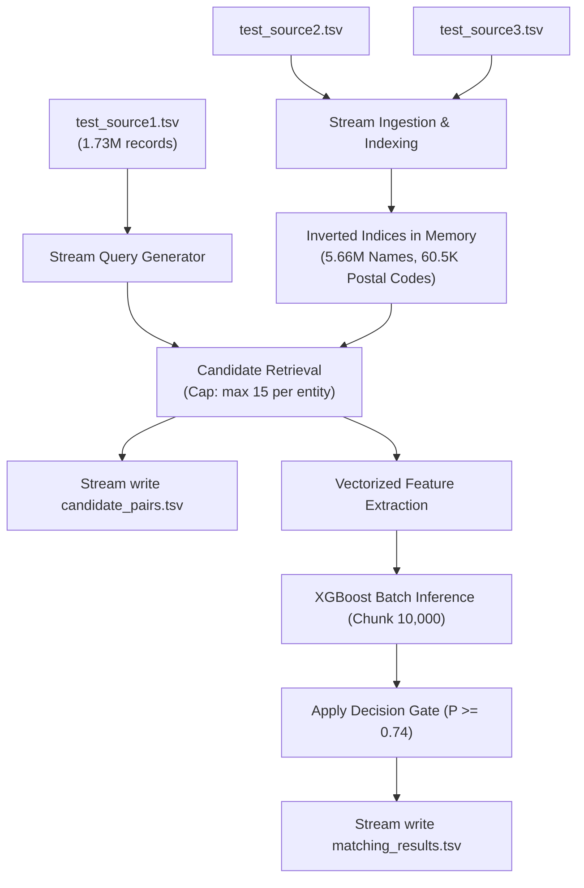
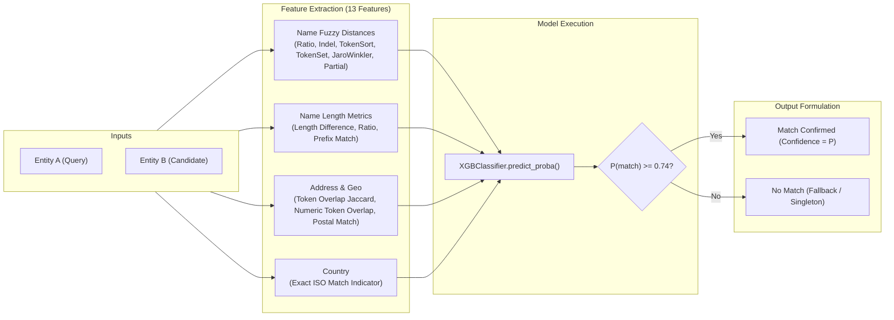
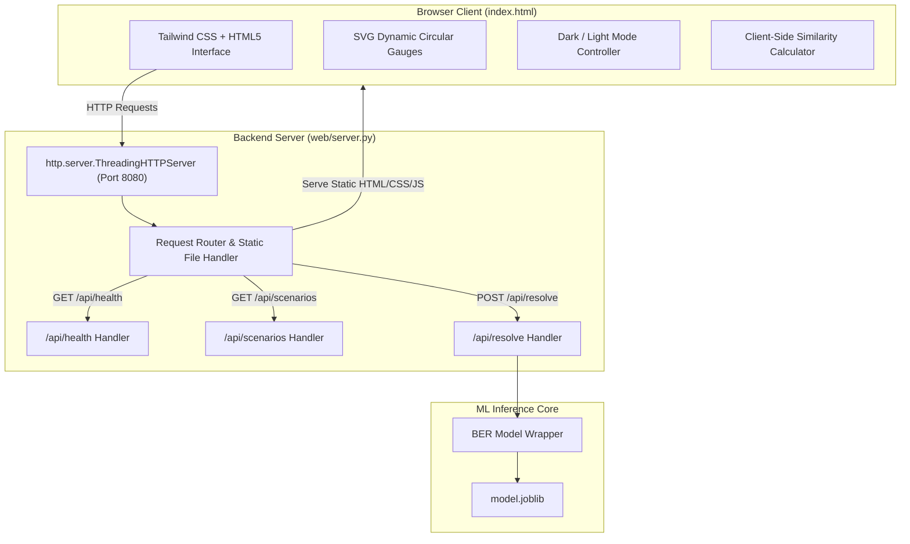

# Business Entity Resolution (BER Pro) — System Architecture

This document provides the definitive architectural specification for the **Business Entity Resolution (BER Pro)** production system, detailing data flow, ML pipelines, candidate blocking, pairwise feature extraction, threshold calibration, backend server design, frontend dashboard architecture, and security governance.

---

## 1. System Overview

BER Pro solves the challenge of cross-source enterprise entity resolution across multi-million row business registries. Given query records from **Source 1** and target pools from **Source 2** and **Source 3**, the system identifies whether each Source 1 business entity matches one or more target records, or represents a singleton (unmatched entity).



---

## 2. End-to-End Data Flow

The data flow enforces three invariant properties:
1. **Candidate Persistency**: Every pair scored by the model must originate from `candidate_pairs.tsv`.
2. **Subset Constraint**: $matching\_results \subseteq candidate\_pairs$.
3. **Singleton Completeness**: Every Source 1 entity appears exactly once in both output files. Singletons are represented with an empty match field.



---

## 3. Training Pipeline

The training pipeline constructs balanced training sets from ground-truth annotations and hard negatives mined from blocking index collisions.



---

## 4. Validation Pipeline

To eliminate data leakage, validation splits are grouped strictly on `source1_id` using `GroupKFold`. All candidate pairs associated with a given Source 1 entity are held out together.



---

## 5. Test Pipeline

The test pipeline is fully decoupled from training and operates strictly on unlabelled test data:



---

## 6. Inference Pipeline

The inference pipeline supports both batch streaming (via `src/scale_inference.py`) and single-pair real-time scoring (via `web/server.py`):



---

## 7. Candidate-Generation Architecture (Multi-Stage Blocking)

Naive Cartesian all-pairs comparison would require:
$$\text{Pairs} = 1{,}732{,}544 \times (4{,}887{,}273 + 5{,}082{,}316) \approx 1.72 \times 10^{13} \text{ pairs}$$
Evaluating $1.72 \times 10^{13}$ pairs is computationally infeasible. BER Pro utilizes three complementary hash-indexed blocking stages with $O(1)$ lookup:

1. **Stage 1 (Exact Normalized Legal Name Index)**:
   Maps cleaned, lowercased, legal-suffix-stripped entity names directly to target entity IDs.
2. **Stage 2 (Postal Code Bucket Index)**:
   Extracts digit sequences from addresses and indexes targets within the same postal code.
3. **Stage 3 (Address Token Overlap Index)**:
   Inverts address tokens (filtering high-frequency words) to match entities with matching street names or suite numbers.
4. **Candidate Pruning**:
   Candidates per entity are unioned and capped at `max_candidates=15` to ensure linear $O(N)$ execution time.

---

## 8. Feature-Engineering Architecture (13 Dimensions)

Every candidate pair $(S_1, S_2)$ is converted into a 13-dimensional numerical vector:

| # | Feature Name | Description | Algorithm |
| :---: | :--- | :--- | :--- |
| 1 | `name_ratio` | Normalized Levenshtein similarity on raw names | RapidFuzz `fuzz.ratio` |
| 2 | `clean_name_ratio` | Normalized Levenshtein similarity on cleaned names | RapidFuzz `fuzz.ratio` |
| 3 | `name_token_sort` | Token-sort ratio (word order independent) | RapidFuzz `fuzz.token_sort_ratio` |
| 4 | `name_token_set` | Token-set ratio (handles duplicate/extra tokens) | RapidFuzz `fuzz.token_set_ratio` |
| 5 | `name_jaro_winkler`| Prefix-biased character distance | RapidFuzz `distance.JaroWinkler` |
| 6 | `name_partial_ratio`| Best matching substring similarity | RapidFuzz `fuzz.partial_ratio` |
| 7 | `name_len_diff` | Absolute difference in name string lengths | $\|len(A) - len(B)\|$ |
| 8 | `name_len_ratio` | Ratio of shorter name to longer name | $\min(L_1, L_2) / \max(L_1, L_2)$ |
| 9 | `name_prefix_match`| Binary flag: exact match on first 4 characters | $A[:4] == B[:4]$ |
| 10| `addr_token_overlap`| Jaccard similarity of address word tokens | $\|T_A \cap T_B\| / \|T_A \cup T_B\|$ |
| 11| `addr_num_overlap` | Jaccard similarity of numeric address tokens | $\|N_A \cap N_B\| / \|N_A \cup N_B\|$ |
| 12| `postal_match` | Equality indicator of extracted postal codes | $P_A == P_B$ |
| 13| `country_match` | Equality indicator of ISO country codes | $C_A == C_B$ |

---

## 9. Machine Learning Architecture

The classification core uses **XGBoost (3.4.1)**:
* **Algorithm**: Gradient Boosted Decision Trees (`XGBClassifier`)
* **Objective**: `binary:logistic`
* **Tree Parameters**: `n_estimators=300`, `max_depth=6`, `learning_rate=0.05`, `subsample=0.8`, `colsample_bytree=0.8`
* **Calibration**: Platt scaling (logistic sigmoid mapping over tree margins)
* **Decision Optimization**: Threshold search maximizing entity-level Macro $F_{0.5}$:
  $$F_{0.5} = \frac{(1 + 0.5^2) \times \text{Precision} \times \text{Recall}}{0.5^2 \times \text{Precision} + \text{Recall}} = \frac{1.25 \times \text{Precision} \times \text{Recall}}{0.25 \times \text{Precision} + \text{Recall}}$$
  Since precision is weighted twice as heavily as recall, the optimal threshold shifts from default 0.50 up to **0.7400**, suppressing false positives.

---

## 10. Web Dashboard Architecture

The review dashboard is designed with a lightweight, multi-threaded native Python backend and a zero-dependency frontend single-page application:



---

## 11. Security Architecture

1. **Zero-Trust Input Sanitization**:
   All entity strings are stripped, sanitized, and normalized before feature computation.
2. **Zero-Secrets Policy**:
   No credentials, tokens, SSH keys, passwords, or connection strings are stored in code or repository tracking.
3. **Network Isolation**:
   The entire pipeline and web server run completely offline on `localhost` without outbound cloud API dependencies.
4. **File Size Enforcement**:
   Generated multi-gigabyte TSVs are strictly excluded via `.gitignore` to prevent repository bloat and GitHub push failure.

---

## 12. Repository Architecture

```text
BER pro/
├── ARCHITECTURE.md                             # Comprehensive architectural specifications
├── BER_Model_Accuracy_and_Web_UI_Summary.pdf  # 4-page executive summary PDF report
├── DOCUMENTATION.md                            # Complete engineering documentation
├── LICENSE                                     # Proprietary All-Rights-Reserved license
├── README.md                                   # Root project overview and operational guide
├── TECHNOLOGY_STACK.md                         # Complete technology inventory and audit
├── .gitignore                                  # Security-hardened exclusions
├── pyproject.toml                              # PEP 517 build configuration
├── requirements.txt                            # Production package dependencies
│
├── artifacts/
│   └── model.joblib                            # Serialized trained XGBoost booster (429 KB)
│
├── config/
│   ├── __init__.py
│   └── settings.py                             # Centralized pipeline configuration dataclasses
│
├── output/
│   └── .gitkeep                                # Tracked output folder (TSVs excluded by .gitignore)
│
├── scripts/
│   ├── evaluate_model.py                       # Standalone rigorous evaluation script
│   ├── preview_demo.py                         # Console benchmark scenarios runner
│   ├── run_pipeline.bat                        # Windows Batch end-to-end pipeline launcher
│   ├── run_pipeline.ps1                        # PowerShell end-to-end pipeline launcher
│   ├── start_webapp.bat                        # Windows Batch web server launcher
│   └── start_webapp.ps1                        # PowerShell web server launcher
│
├── src/
│   ├── __init__.py
│   ├── blocking.py                             # Multi-stage inverted index candidate generator
│   ├── features.py                             # 13 pairwise string and contextual similarity features
│   ├── inference.py                            # Pair scoring and threshold gating
│   ├── metrics.py                              # Official entity-level Macro F0.5 implementation
│   ├── model.py                                # XGBoost classifier wrapper and persistence
│   ├── normalization.py                        # Text cleaning, legal suffixes, postal extraction
│   ├── pipeline.py                             # Standard batch pipeline coordinator
│   ├── scale_inference.py                      # Memory-constant streaming generator for 9.97M rows
│   ├── threshold.py                            # Grid search threshold optimization
│   └── training.py                             # Grouped validation and model training
│
├── tests/
│   ├── __init__.py
│   ├── test_blocking.py                        # Unit tests for candidate blocking
│   ├── test_compliance.py                      # Submission format compliance integration test
│   ├── test_features.py                        # Unit tests for 13 pairwise features
│   ├── test_metrics.py                         # Unit tests for Macro F0.5 and singleton rules
│   └── test_normalization.py                  # Unit tests for text cleaning and regex
│
├── utils/
│   ├── __init__.py
│   └── validator.py                            # Submission TSV schema and constraint validator
│
└── web/
    ├── server.py                               # Multi-threaded HTTP server with REST JSON API
    └── static/
        └── index.html                          # Responsive SPA review dashboard
```
