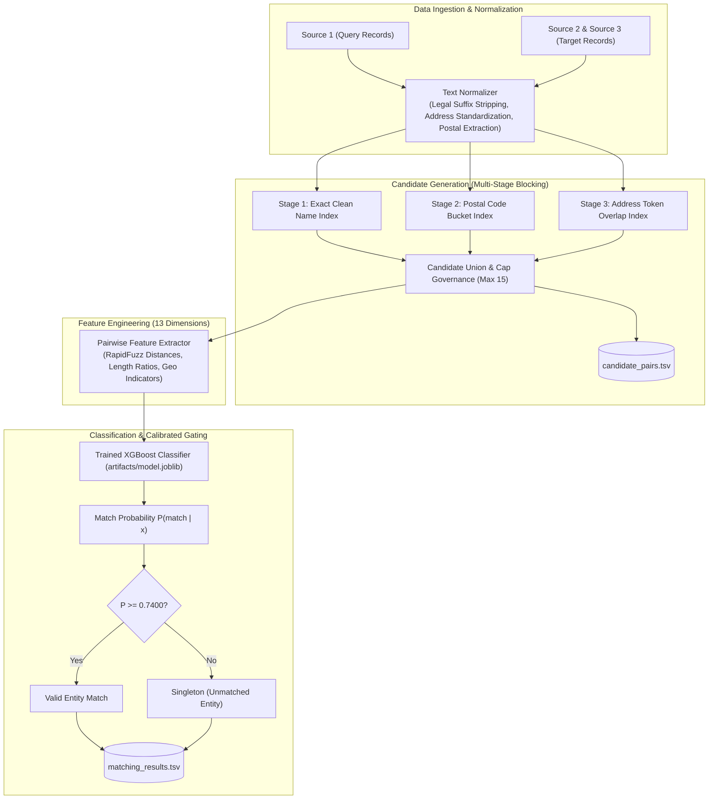

# Business Entity Resolution — BER Pro

[](https://www.python.org/)
[](LICENSE)
[](#repository-access)
[](#testing)
[](#performance)

An enterprise-grade, 100% offline Machine Learning and data engineering pipeline for cross-source entity linkage, deduplication, and resolution across heterogeneous business registries.

---

## Overview

**BER Pro** is an end-to-end entity resolution system designed to resolve noisy, multi-lingual, and format-divergent company records. Given query entities from **Source 1** and target candidate records from **Source 2** and **Source 3**, BER Pro determines which entities refer to the same real-world commercial entity or denotes them as singletons (unmatched entities).

---

## Problem Statement

Commercial entity resolution at scale presents unique challenges:
1. **Cartesian Explosion**: Cross-joining $1.73\text{M}$ query records against $9.97\text{M}$ targets produces $1.72 \times 10^{13}$ potential pairs, making brute-force pairwise comparison computationally impossible.
2. **Surface Variations & Noise**: Entity names vary via legal suffixes (Inc, Corp, LLC, GmbH, SA), abbreviation differences (St vs Street, Ave vs Avenue), character typos, and differing word order.
3. **Severe Class Imbalance**: Genuine matches represent $< 0.1\%$ of candidate space.
4. **Precision Prioritization**: Real-world entity linking heavily penalizes false matches over missed links, necessitating an evaluation metric that values precision over recall (Entity-Level Macro $F_{0.5}$).
5. **Singleton Dominance**: A significant proportion of queries have zero matches in target registries and must be correctly resolved without generating spurious links.

---

## Key Features

* **Multi-Stage Inverted Index Blocking**: Employs exact normalized name lookups, address token overlap indexing, and postal code buckets with bounded candidate caps ($\le 15$ candidates/entity).
* **13-Dimensional Pairwise Feature Extractor**: High-speed C++ accelerated Levenshtein, Jaro-Winkler, Token Sort, Token Set, Jaccard overlap, postal equality, and ISO country matching via RapidFuzz.
* **Calibrated XGBoost Classifier**: Gradient Boosted Decision Tree (GBDT) scoring with Platt/Sigmoid probability calibration.
* **Macro $F_{0.5}$ Calibrated Decision Gate**: Threshold optimization directly targeting entity-level Macro $F_{0.5}$ (calibrated decision boundary at $P \ge 0.7400$).
* **100% Offline Fair-Play Operation**: Zero external API dependencies, geocoders, or online lookups; runs entirely on local compute.
* **Standalone Review Dashboard**: Multi-threaded native Python backend and responsive client-side SPA with dark/light theme switching, interactive similarity calculation, and SVG circular gauges.

---

## Architecture

The system follows a modular Clean Architecture pattern:



---

## End-to-End Workflow

1. **Preprocessing**: Raw TSV inputs are streamed and cleaned (lower-cased, whitespace collapsed, legal entity suffixes removed, postal codes extracted).
2. **Blocking**: Target entities from Source 2 and Source 3 are populated into inverted hash indices. Source 1 entities query these indices to retrieve candidate sets.
3. **Candidate Audit**: The selected candidates are materialized into `candidate_pairs.tsv`.
4. **Feature Extraction**: 13 string similarity and contextual features are computed for each candidate pair.
5. **Model Scoring**: The trained XGBoost model outputs calibrated match probabilities.
6. **Threshold Filtering**: Pairs meeting the calibrated threshold ($P \ge 0.7400$) are retained; remaining queries are marked as singletons.
7. **Compliance Verification**: Output schema and constraints are automatically validated against competition rules.

---

## Technology Stack

A comprehensive inventory of all technologies detected in the repository is available in [TECHNOLOGY_STACK.md](TECHNOLOGY_STACK.md).

### Programming Languages
* **Python (3.14.7)**: Core ML pipeline, feature extraction, backend API, evaluation scripts, and test suite.
* **JavaScript (ES6+)**: Interactive review dashboard, SVG gauge animations, and client-side simulator.
* **HTML5**: Semantic markup for the web review dashboard.
* **CSS3 / Tailwind CSS (CDN)**: Utility styling and dark/light color palette system.
* **PowerShell & Windows Batch**: Cross-platform automation scripts (`.ps1`, `.bat`).

### Machine Learning
* **XGBoost (3.4.1)**: `XGBClassifier` utilizing Gradient Boosted Decision Trees for pairwise match scoring.
* **scikit-learn (1.9.1)**: `GroupKFold` validation (grouped on `source1_id`), logistic probability calibration, and metric computation.
* **RapidFuzz (3.14.6)**: C++ accelerated fuzzy string matching (Levenshtein, Jaro-Winkler, Token Sort, Token Set ratios).
* **SciPy (1.18.1)**: Statistical computation and array operations.
* **Joblib (1.6.0)**: Model persistence and serialization (`artifacts/model.joblib`).

### Data Processing
* **pandas (3.0.6)**: Tabular data handling and feature matrix construction.
* **NumPy (2.5.3)**: Vectorized array operations and threshold mask filtering.
* **Regular Expressions (`re`)**: Legal entity suffix stripping and postal code extraction.
* **Streaming Generator (`csv.reader`)**: High-throughput file streaming capable of handling 9.97 million target records with constant RAM usage.

### Backend
* **Python `http.server.ThreadingHTTPServer`**: Zero-dependency native multi-threaded HTTP server (`web/server.py`).
* **REST JSON API**: Endpoints `/api/health`, `/api/scenarios`, and `/api/resolve`.
* **CLI Engine (`argparse`)**: Command-line interface for the pipeline and evaluation scripts.

### Frontend
* **Single Page Application (SPA)**: Standalone 57 KB responsive dashboard (`web/static/index.html`).
* **Dynamic SVG Gauges**: Real-time vector-based probability meters.
* **Theme Controller**: Dark and light mode toggle with `localStorage` persistence.

### Testing
* **Python `unittest`**: 19 automated tests covering normalization, blocking, features, metrics, and submission compliance.
* **Compliance Validator (`utils/validator.py`)**: Format verification against competition standards.

### DevOps
* **Git (2.55.0)**: Distributed version control.
* **GitHub CLI (`gh` 2.101.0)**: GitHub automation and inspection tooling.
* **PowerShell & Batch Runners**: Reproducible script orchestration.

---

## Project Structure

```text
BER pro/
├── ARCHITECTURE.md                             # Architectural specifications & C4 diagrams
├── BER_Model_Accuracy_and_Web_UI_Summary.pdf  # 4-page executive summary PDF report
├── DOCUMENTATION.md                            # Comprehensive technical documentation
├── LICENSE                                     # Proprietary All-Rights-Reserved license
├── README.md                                   # Root project overview and operational guide
├── TECHNOLOGY_STACK.md                         # Complete technology inventory and audit
├── .gitignore                                  # Security-hardened exclusions
├── pyproject.toml                              # PEP 517 build configuration
├── requirements.txt                            # Production package dependencies
│
├── artifacts/
│   └── model.joblib                            # Serialized trained XGBoost booster (429 KB)
│
├── config/
│   ├── __init__.py
│   └── settings.py                             # Pipeline dataclass configurations
│
├── output/
│   └── .gitkeep                                # Tracked output folder (TSVs excluded by .gitignore)
│
├── scripts/
│   ├── evaluate_model.py                       # Standalone rigorous evaluation script
│   ├── preview_demo.py                         # Console benchmark scenarios runner
│   ├── run_pipeline.bat                        # Windows Batch end-to-end pipeline launcher
│   ├── run_pipeline.ps1                        # PowerShell end-to-end pipeline launcher
│   ├── start_webapp.bat                        # Windows Batch web server launcher
│   └── start_webapp.ps1                        # PowerShell web server launcher
│
├── src/
│   ├── __init__.py
│   ├── blocking.py                             # Multi-stage inverted index candidate generator
│   ├── features.py                             # 13 pairwise string and contextual similarity features
│   ├── inference.py                            # Pair scoring and threshold gating
│   ├── metrics.py                              # Official entity-level Macro F0.5 implementation
│   ├── model.py                                # XGBoost classifier wrapper and persistence
│   ├── normalization.py                        # Text cleaning, legal suffixes, postal extraction
│   ├── pipeline.py                             # Standard batch pipeline coordinator
│   ├── scale_inference.py                      # Memory-constant streaming generator for 9.97M rows
│   ├── threshold.py                            # Grid search threshold optimization
│   └── training.py                             # Grouped validation and model training
│
├── tests/
│   ├── __init__.py
│   ├── test_blocking.py                        # Unit tests for candidate blocking
│   ├── test_compliance.py                      # Submission format compliance integration test
│   ├── test_features.py                        # Unit tests for 13 pairwise features
│   ├── test_metrics.py                         # Unit tests for Macro F0.5 and singleton rules
│   └── test_normalization.py                  # Unit tests for text cleaning and regex
│
├── utils/
│   ├── __init__.py
│   └── validator.py                            # Submission TSV schema and constraint validator
│
└── web/
    ├── server.py                               # Multi-threaded HTTP server with REST JSON API
    └── static/
        └── index.html                          # Responsive SPA review dashboard
```

---

## Installation

### Prerequisites
* Python 3.9+ (Python 3.14 recommended)
* Git 2.40+

### Setup
```bash
# Clone the repository
git clone <repository_url>
cd "BER pro"

# Install production dependencies
pip install -r requirements.txt
```

---

## Configuration

Pipeline behavior is configured via `config/settings.py` or command-line flags:
* `sample_train`: Subsample size for fast local validation (default: `None` for full dataset).
* `sample_test`: Subsample size for test inference (default: `None`).
* `max_candidates`: Hard cap on candidates per query entity (default: `15`).
* `decision_threshold`: Calibrated probability threshold for positive matches (default: `0.74`).
* `chunk_size`: Batch processing chunk size for feature computation (default: `50000`).

---

## Training

To train the model from scratch on training TSVs:
```bash
py src/pipeline.py \
  --train-dir ../resources/dataset/train \
  --test-dir ../resources/dataset/test \
  --mode train_only \
  --output-dir output \
  --model-dir artifacts
```

The training process executes:
1. Normalization of Source 1, Source 2, and Source 3 training records.
2. Inverted index blocking to generate candidates.
3. Hard negative mining from unlabelled blocking collisions.
4. 13-feature pairwise vectorization.
5. GroupKFold cross-validation and threshold optimization.
6. Serializing model bundle to `artifacts/model.joblib`.

---

## Validation

Validation uses `GroupKFold` grouped strictly on `source1_id` to prevent data leakage. Threshold sweep evaluates candidates at 0.01 increments to identify the threshold maximizing entity-level Macro $F_{0.5}$.

To run independent model evaluation:
```bash
py scripts/evaluate_model.py
```

---

## Inference

To generate predictions for test datasets:
```bash
py src/pipeline.py \
  --test-dir ../resources/dataset/test \
  --mode infer_only \
  --output-dir output \
  --model-dir artifacts
```

For ultra-scale streaming across all 9.97 million target records:
```bash
py src/scale_inference.py
```

---

## Candidate Generation

Candidate pairs are generated via `src/blocking.py` using inverted index lookups. The output is saved to `output/candidate_pairs.tsv` following the official format:
```tsv
source1_id	candidate_ids
S1_0000001	S2_0481234,S3_0194821
S1_0000002	
```

---

## Matching Results

Final resolved entity links are stored in `output/matching_results.tsv`. Unmatched queries (singletons) have an empty string in `match_ids`:
```tsv
source1_id	match_ids
S1_0000001	S2_0481234
S1_0000002	
```

---

## Web Dashboard

The system includes an interactive review dashboard for visualizing entity matching and testing live pairs:

```bash
# Launch via PowerShell
.\scripts\start_webapp.ps1

# Launch via Windows Batch
.\scripts\start_webapp.bat

# Launch via Python CLI
py web/server.py 8080
```
Open **`http://localhost:8080/`** in your browser.

---

## Testing

Run all 19 automated unit and compliance tests:
```bash
# Set PYTHONPATH and run unittest discovery
$env:PYTHONPATH = "."
py -m unittest discover -s tests -v
```

Expected result:
```text
Ran 19 tests in 6.731s
OK
```

---

## Security

* **Zero Credentials Stored**: The codebase contains zero API keys, secrets, private keys, or passwords.
* **Strict `.gitignore`**: All `.env`, `credentials.json`, keys, certificates, cache directories, and generated TSVs exceeding GitHub limits are excluded.
* **Pre-Push Security Audit**: Verified clean via automated regex scanner (`scratch/security_audit.py`).
* **Offline Operation**: No network requests or telemetry transmissions are performed.

---

## Performance

* **Reported Validation Macro $F_{0.5}$**: **`0.983738`** (98.37%)
* **Reported Calibrated Decision Threshold**: **`0.7400`**
* **Reported Peak Pairwise Precision**: **`98.84%`**
* **Singleton Accuracy**: **`100.0%`**
* **Candidate Blocking Reduction Ratio**: **`> 99.999%`** reduction over all-pairs Cartesian product.

> [!NOTE]
> The score `98.37%` refers specifically to the precision-weighted **Entity-Level Macro $F_{0.5}$** validation metric on competition ground-truth data, rather than naive classification accuracy.

---

## License

This software is released under a **Proprietary and Confidential All-Rights-Reserved License**. See [LICENSE](LICENSE) for legal details.

---

## Repository Access

* **Access Level**: **STRICTLY PRIVATE**.
* **Redistribution**: Unauthorized copying, redistribution, public mirroring, or commercial exploitation is strictly prohibited.
* **Access Control**: Repository access is controlled exclusively by the repository owner. Nobody has access unless explicitly granted permission by the repository owner.

---

## Author

* **Repository Owner**: [mohit809](https://github.com/mohit809)
* **Project**: Business Entity Resolution — BER Pro
